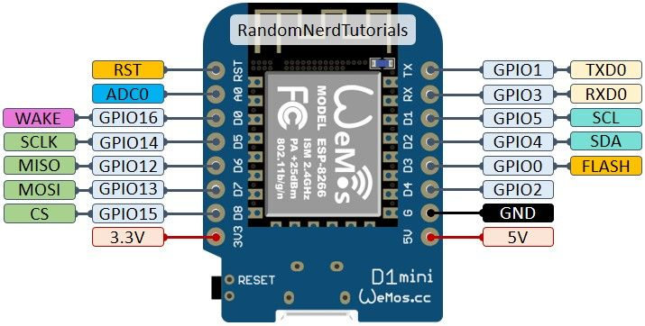

# Raspberry PI

## Pin layout
    ,--------------------------------.
    | yyoooooooooooooooooo J8   +======
    | 1ooooooooooooooooooo  PoE |   Net
    |  Wi                    oo +======
    |  Fi  Pi Model 4B  V1.2 oo      |
    |        ,----.               +====
    | |D|    |SoC |               |USB3
    | |S|    |    |               +====
    | |I|    `----'                  |
    |                   |C|       +====
    |                   |S|       |USB2
    | pwr   |HD|   |HD| |I||A|    +====
    `-| |---|MI|---|MI|----|V|-------'

    Revision           : c03112
    SoC                : BCM2711
    RAM                : 4096Mb
    Storage            : MicroSD
    USB ports          : 4 (excluding power)
    Ethernet ports     : 1
    Wi-fi              : True
    Bluetooth          : True
    Camera ports (CSI) : 1
    Display ports (DSI): 1

    J8:
       3V3  (1) (2)y 5V
     GPIO2  (3) (4)y 5V
     GPIO3  (5) (6)  GND
     GPIO4  (7) (8)  GPIO14
       GND  (9) (10) GPIO15
    GPIO17 (11) (12) GPIO18
    GPIO27 (13) (14) GND
    GPIO22 (15) (16) GPIO23
       3V3 (17) (18) GPIO24
    GPIO10 (19) (20) GND
     GPIO9 (21) (22) GPIO25
    GPIO11 (23) (24) GPIO8
       GND (25) (26) GPIO7
     GPIO0 (27) (28) GPIO1
     GPIO5 (29) (30) GND
     GPIO6 (31) (32) GPIO12
    GPIO13 (33) (34) GND
    GPIO19 (35) (36) GPIO16
    GPIO26 (37) (38) GPIO20
       GND (39) (40) GPIO21

## Serial pins

Command `% raspi-gpio get` shows assignments of all GPIO pins. Find serial pins using `raspi-gpio get | grep -e 'TX\|RX'`:

```
% raspi-gpio get | grep -e 'TX\|RX'
GPIO 0: level=1 fsel=3 alt=4 func=TXD2 pull=NONE
GPIO 1: level=1 fsel=3 alt=4 func=RXD2 pull=UP
GPIO 4: level=1 fsel=3 alt=4 func=TXD3 pull=NONE
GPIO 5: level=1 fsel=3 alt=4 func=RXD3 pull=UP
GPIO 14: level=1 fsel=2 alt=5 func=TXD1 pull=NONE
GPIO 15: level=1 fsel=2 alt=5 func=RXD1 pull=UP
GPIO 32: level=1 fsel=7 alt=3 func=TXD0 pull=NONE
GPIO 33: level=1 fsel=7 alt=3 func=RXD0 pull=UP
```




Connect pins:

PI - ESP8266

| PI | ESP |
|--|--|
| 6 (GND) | GND |
| 27 (GPIO0) (TXD2) | D6 (GPIO12) |
| 28 (GPIO1) (RXD2) | D7 (GPIO13) |
|--|--|


